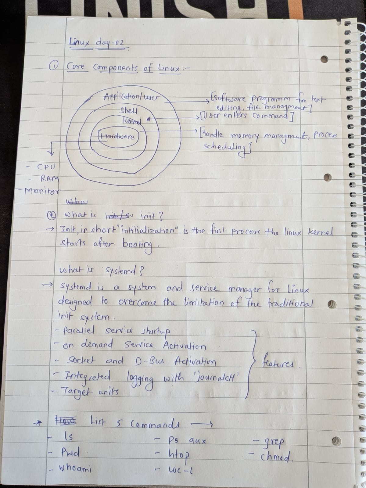
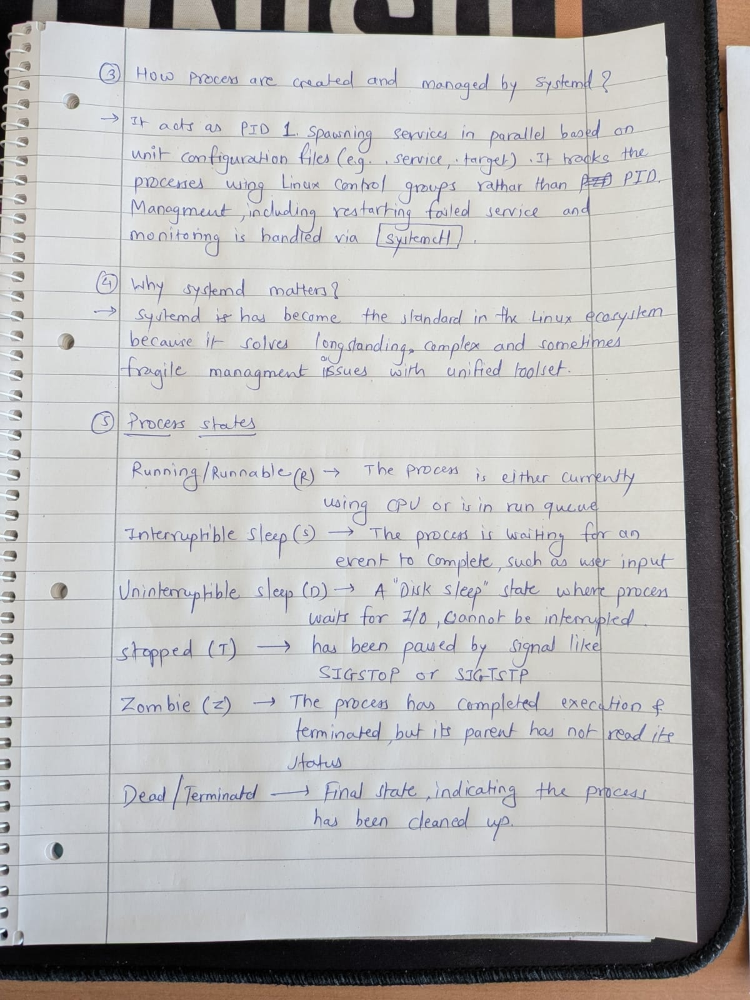

create a short note that explains:

- The core components of Linux (kernel, user space, init/systemd)
- How processes are created and managed
- What systemd does and why it matters

This is the foundation for all troubleshooting you will do as a DevOps engineer.

## Guidelines

Follow these rules while creating your notes:

- Explain **process states** (running, sleeping, zombie, etc.)
- List **5 commands** you would use daily
- Keep it **short and practical** (under 1 page)
- Use bullet points and short headings

---

