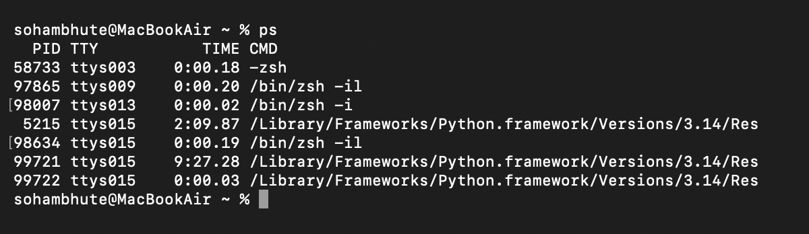
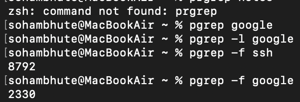
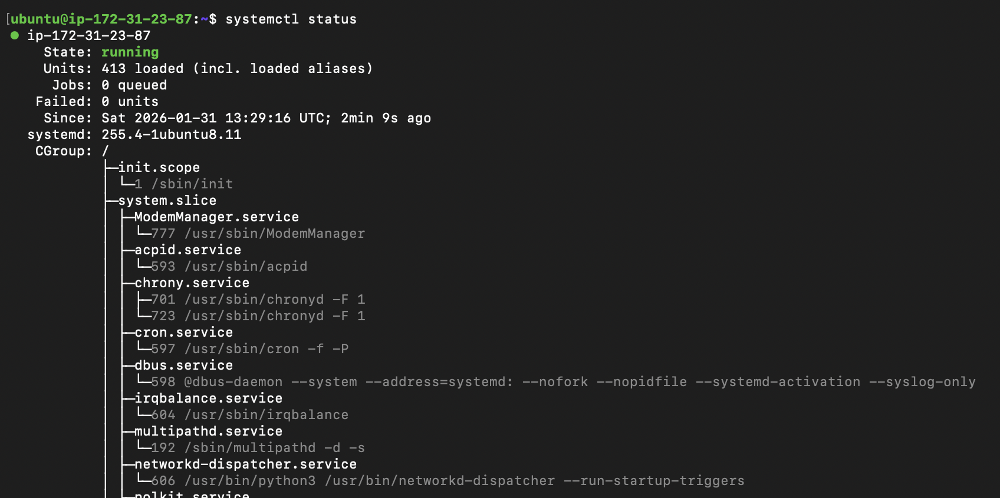
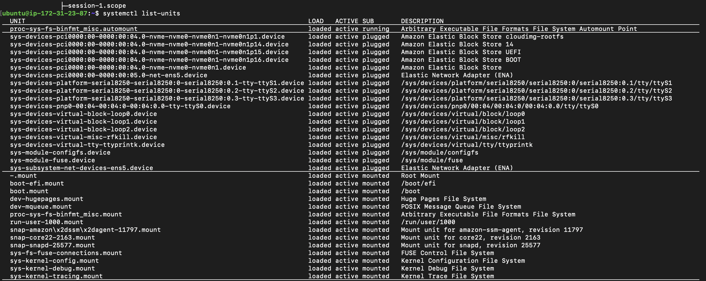
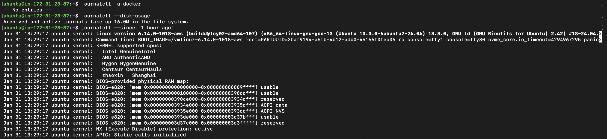
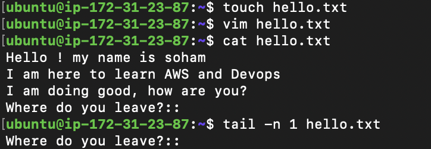
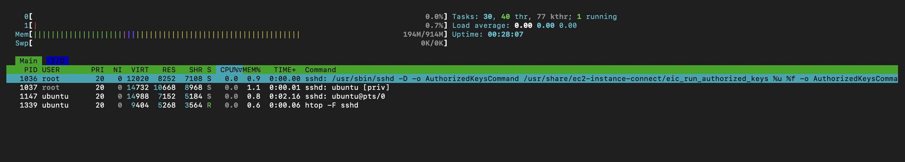

## Day04 Tasks

## ps ->

## top ->

## pgrep ->

# Service Commands

## systemctl status, systemctl list units

## journalctl

## Pick one service on your system (example: ssh, cron, docker) and inspect it

