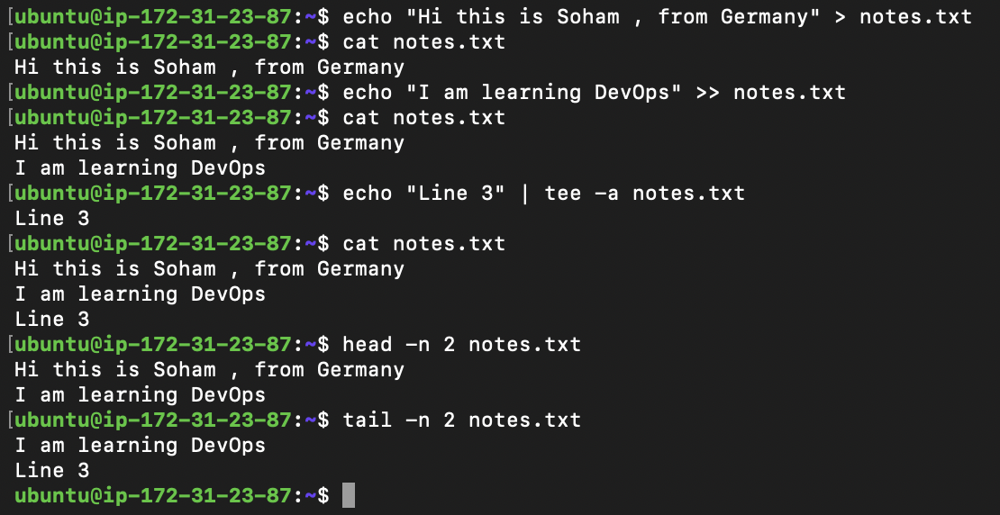

## Guidelines Day06

- Follow these rules while creating your practice note:

- Create a file named notes.txt
- Write 3 lines into the file using redirection (> and >>)
- Use cat to read the full file
- Use head and tail to read parts of the file
- Use tee once to write and display at the same time
- Keep it short (8–12 lines total in the file)

