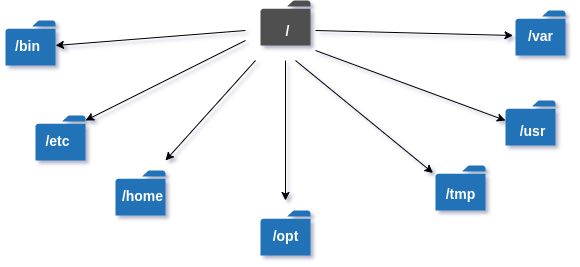
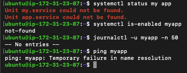

### Part 1: Linux File System Hierarchy (30 minutes)

Document the purpose of these **essential** directories:



**Core Directories (Must Know):**

- `/` (root) - The starting point of everything
  - the folder is root for all linux file structure. it contains folders like mnt ,proc, sys ,tmp and home
  - the root user's home directory is located under this folder

- `/home` - User home directories
  - it is the default top level directory containing personal folders for all non-root user.
  - this folder also seperates personal data from system files (/bin,/etc,/usr)
- `/root` - Root user's home directory
  - this folder contains files like .bashrc, .ssh .profile. to add alias for the commanly used commands
  - a secure and centralized location for the root user to store personal files, configuration settings, and perform administrative tasks
- `/etc` - Configuration files
  - it has /etc folder under which system configuration files are stored
- `/var/log` - Log files (very important for DevOps!)
  - These files record crucial system events, logins, and activity history for monitoring and troubleshooting
- `/tmp` - Temporary files
  - Provides temporary storage space for files, which is typically cleared on system reboot.

**Additional Directories (Good to Know):**

- `/bin` - Essential command binaries
  - Contains essential binary or executable programs required for basic system operation.
- `/usr/bin` - User command binaries
  - Contains user-related programs, utilities, and shared resources.
- `/opt` - Optional/third-party applications
  - Holds optional or third-party software packages installed separately from the system

### Part 2: Scenario-Based Practice (40 minutes)

**Scenario 1: Service Not Starting**

```
A web application service called 'myapp' failed to start after a server reboot.
What commands would you run to diagnose the issue?
Write at least 4 commands in order.
```

**Hint:**

- First check: Is the service running or failed?
  - `systemctl status myapp`
  - why ? because it will show if the web application is active or failed

- Then check: What do the logs say?
  - `systemctl is-enabled myapp`
  - there are no logs found related to service

- Finally check: Is it enabled to start on boot?
  - `journalctl -u myapp -n 50`



**Scenario 2: High CPU Usage**

```
Your manager reports that the application server is slow.
You SSH into the server. What commands would you run to identify
which process is using high CPU?
```

**Hint:**

- Use a command that shows **live** CPU usage
  - `htop`
- Look for processes sorted by CPU percentage
  - once in `htop` press f6 and select the option by cpu percentage
- Note the PID (Process ID) of the top process
  - PID -1 usr/lib/systemd

**Scenario 3: Finding Service Logs**

```
A developer asks: "Where are the logs for the 'docker' service?"
The service is managed by systemd.
What commands would you use?
```

**Hint:**

- since the service is managed by systemd services → logs are in journald

- to find the logs the command pattern: `journalctl -u <service-name>`
- Use -n flag to limit number of lines
- Use -f flag to follow logs in real-time (like tail -f)

**Commands to explore:**

```bash
# Check service status first
systemctl status docker

# View last 50 lines of logs
journalctl -u docker -n 50

# Follow logs in real-time
journalctl -u docker -f
```

**Scenario 4: File Permissions Issue**

```
A script at /home/user/backup.sh is not executing.
When you run it: ./backup.sh
You get: "Permission denied"

What commands would you use to fix this?
```

**Hint:**

- First: Check what permissions the file has
- Understand: Files need 'x' (execute) permission to run
- Fix: Add execute permission with chmod

**Step-by-step solution structure:**

```
Step 1: Check current permissions
Command: ls -l /home/user/backup.sh
Look for: -rw-r--r-- (notice no 'x' = not executable)

Step 2: Add execute permission
Command: chmod +x /home/user/backup.sh

Step 3: Verify it worked
Command: ls -l /home/user/backup.sh
Look for: -rwxr-xr-x (notice 'x' = executable)

Step 4: Try running it
Command: ./backup.sh
```
