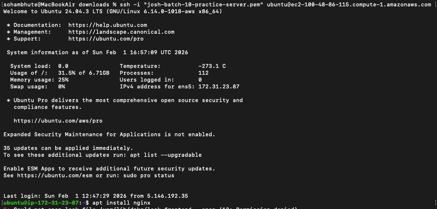
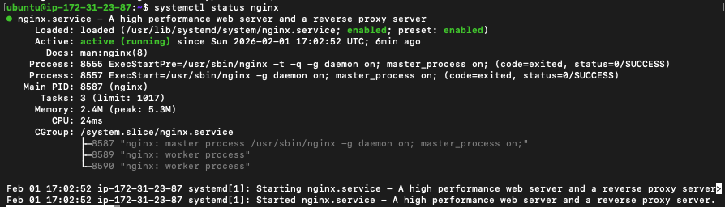
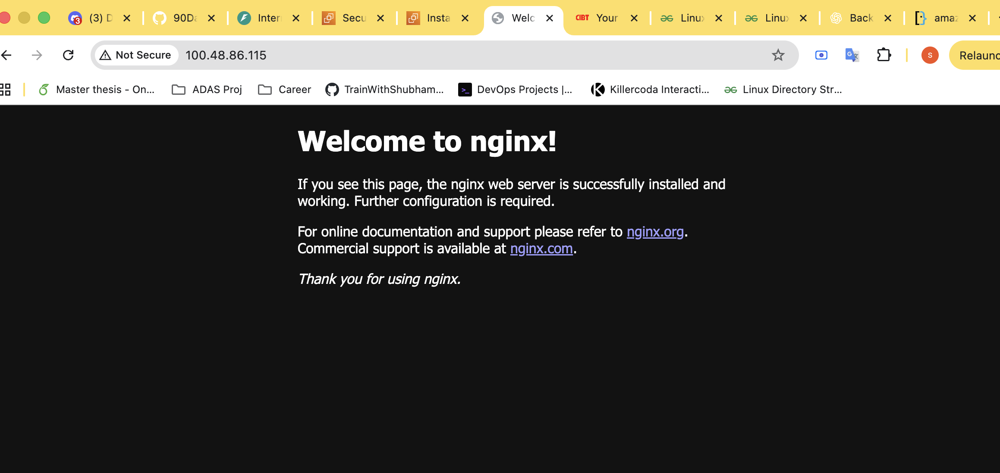

## Commands Used

[List the key commands you used]

- `ssh -i <private_key_file> user@<PublicDNS>`
- `journalctl -u nginx -f` , `systemctl status nginx`
- `http://100.48.86.115/` to acces the page
-

## Challenges Faced

[Describe any issues and how you solved them]

- not able to access Nginx page even if the service is running
- location where nginx logs are stored
- not able to copy the file from EC2 instance to local folder

## What I Learned

- to access the servies inside EC2 one need to modify the inbound rules, because client (web browser) is sending the request to EC2 and it should allow this request
- all system logs are stored under `/var/log` folder
- to download the files from ec2 instance to local machine one needs the `public IPv4 address` since our laptop connected to AWS via internet.

## Expected Output

By the end of today, you should have:

1. A markdown file named: `day-08-cloud-deployment.md`
2. Screenshots showing:
   - SSH connection to your server

   
   
   - Nginx welcome page accessible from browser

   
   - Log file contents

```bash

5.146.192.35 - - [02/Feb/2026:19:56:10 +0000] "GET / HTTP/1.1" 200 409 "-" "Mozilla/5.0 (Macintosh; Intel Mac OS X 10_15_7) AppleWebKit/537.36 (KHTML, like Gecko) Chrome/143.0.0.0 Safari/537.36"
5.146.192.35 - - [02/Feb/2026:19:56:11 +0000] "GET /favicon.ico HTTP/1.1" 404 196 "http://204.236.220.175/" "Mozilla/5.0 (Macintosh; Intel Mac OS X 10_15_7) AppleWebKit/537.36 (KHTML, like Gecko) Chrome/143.0.0.0 Safari/537.36"
5.146.192.35 - - [02/Feb/2026:19:57:13 +0000] "GET / HTTP/1.1" 304 0 "-" "Mozilla/5.0 (Macintosh; Intel Mac OS X 10_15_7) AppleWebKit/537.36 (KHTML, like Gecko) Chrome/143.0.0.0 Safari/537.36"

```

3. The log file: `nginx-logs.txt`

---

## Why This Matters for DevOps

This exercise teaches you:

- **Cloud infrastructure provisioning** - launching and configuring servers
- **Remote server management** - SSH, security, access control
- **Service deployment** - installing and running applications
- **Log management** - accessing and analyzing logs
- **Security** - configuring firewalls and security groups

These are core skills for any DevOps engineer working in production.
