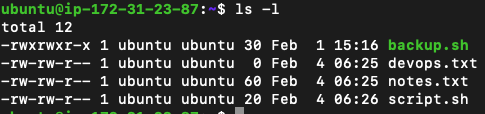
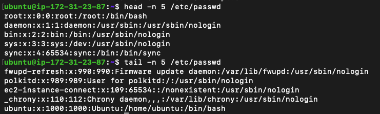
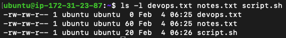
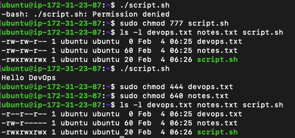

# Day 10 Challenge

## Files Created

## Permission Changes

- Before

- After

## Commands Used

- `touch notes.txt` , `vim script.sh`
- `cat touch.txt`, `head -n 5 /etc/passwd`,`tail -n 5 /etc/passwd`
- `ls -l devops.txt notes.txt script.sh`
- `sudo chmod 777 script.sh`,`sudo chmod 444 devops.txt`, `sudo chmod 640 notes.txt`
- `echo "I am soham" > devops.txt`

## What I Learned

- whenever the console says "permission denied" check the read write permission for any file
- by default , the permission are `-rw-rw-r--` when the user creates the file which means anyone else(outside group) can not write to the file
