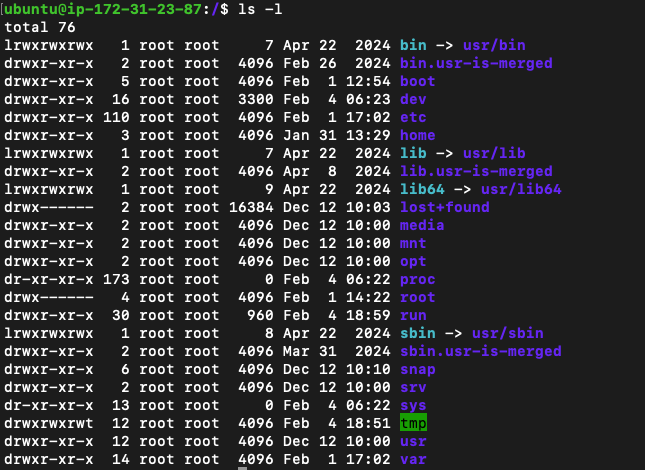
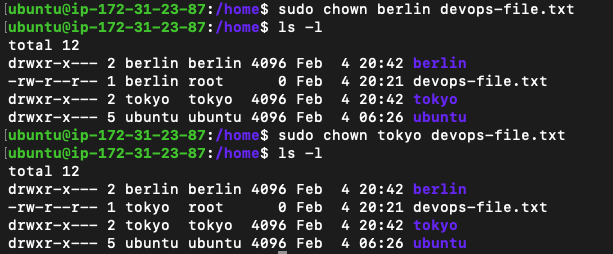
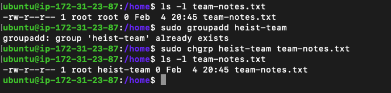
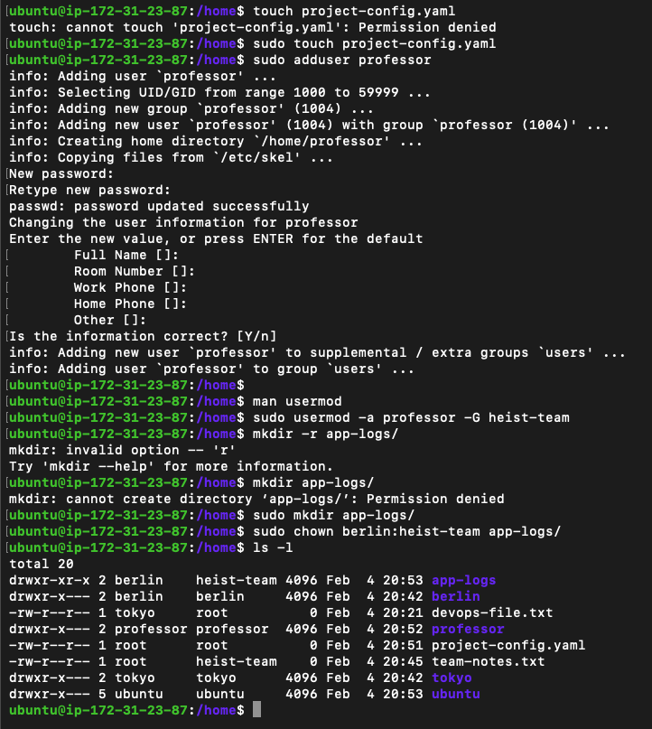
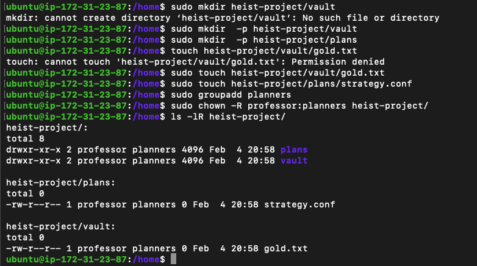
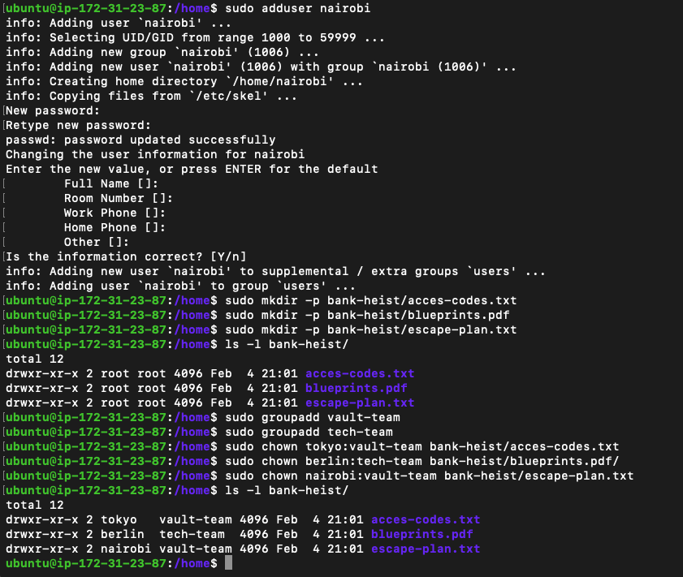

## Task

Master file and directory ownership in Linux.

- Understand file ownership (user and group)
- Change file owner using `chown`
- Change file group using `chgrp`
- Apply ownership changes recursively

```bash
# View ownership
ls -l filename

# Change owner only
sudo chown newowner filename

# Change group only
sudo chgrp newgroup filenameS

# Change both owner and group
sudo chown owner:group filename

# Recursive change (directories)
sudo chown -R owner:group directory/

# Change only group with chown
sudo chown :groupname filename
---
```

## Expected Output

### Task 1: Understanding Ownership



### Task 2: Basic chown Operations



### Task 3: Basic chgrp Operations



### Task 4: Combined Owner & Group Change



### Task 5: Recursive Ownership



### Task 6: Practice Challenge


