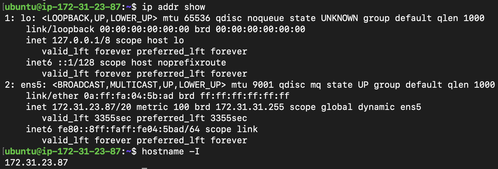
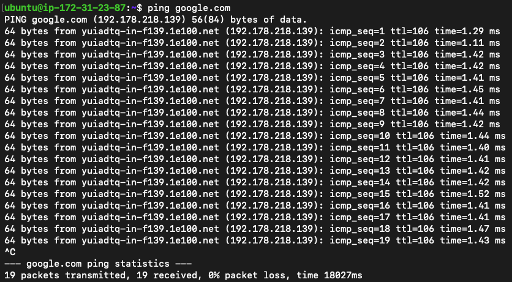
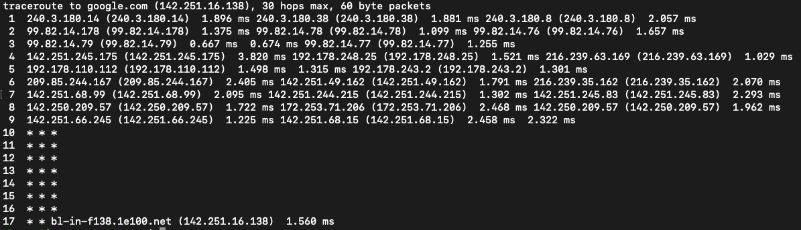
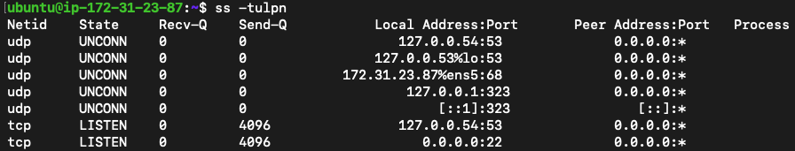
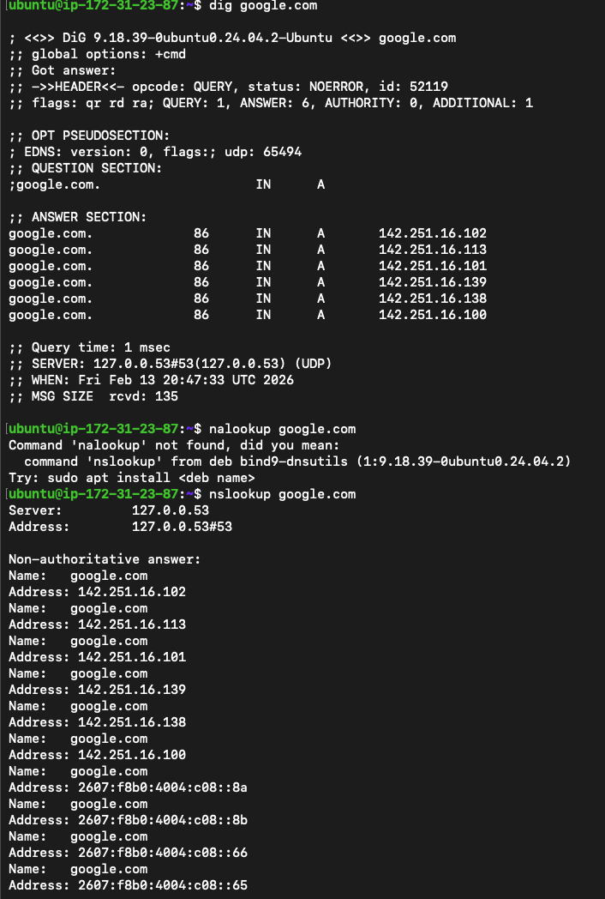
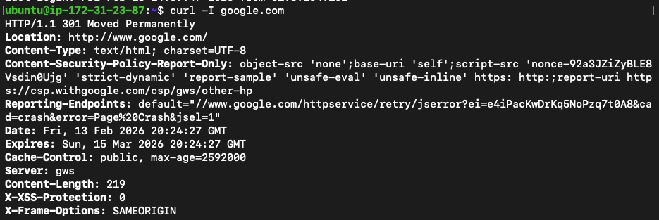
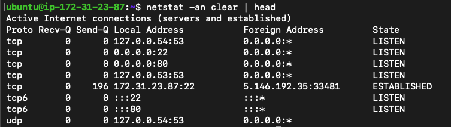
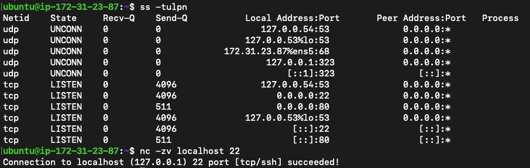

## Map the OSI vs TCP/IP models in your own words

- OSI model goes from Appilcation -> Presentation -> Session -> Transport -> Network -> Data Link -> Physical

- TCP/IP model includes Application (Application + Presentation + Session) -> Transport -> Internet -> Network Access (Data Link + Physical)

## Run essential connectivity commands

- **Identity:** `hostname -I` (or `ip addr show`) — note your IP.

- **Reachability:** `ping <target>` — mention latency and packet loss.

- **Path:** `traceroute <target>` (or `tracepath`) — note any long hops/timeouts.
  - This command will trace the routes from `google.com` to my EC2 ip address

- **Ports:** `ss -tulpn` (or `netstat -tulpn`) — list one listening service and its port.

- **Name resolution:** `dig <domain>` or `nslookup <domain>` — record the resolved IP.
  - since google uses concepts like load balancing,redundancy it has more that one resolved IP shown in screenshot

- **HTTP check:** `curl -I <http/https-url>` — note the HTTP status code.
  - the status code here is 301 and the message says moved permanatly

- **Connections snapshot:** `netstat -an | head` — count ESTABLISHED vs LISTEN (rough).

## Quick Concepts (write 1–2 bullets each)

- OSI layers (L1–L7) vs TCP/IP stack (Link, Internet, Transport, Application)

- Where **IP**, **TCP/UDP**, **HTTP/HTTPS**, **DNS** sit in the stack

- One real example: “`curl https://example.com` = App layer over TCP over IP”

---

## Capture a mini network check for a target host/service

## Mini Task: Port Probe & Interpret

1. Identify one listening port from `ss -tulpn` (e.g., SSH on 22 or a local web app).

2. From the same machine, test it: `nc -zv localhost <port>` (or `curl -I http://localhost:<port>`).

3. Write one line: is it reachable? If not, what’s the next check? (e.g., service status, firewall).

---

    ## Reflection (add to your markdown)

- Which command gives you the fastest signal when something is broken?

- What layer (OSI/TCP-IP) would you inspect next if DNS fails? If HTTP 500 shows up?

- Two follow-up checks you’d run in a real incident.

---
