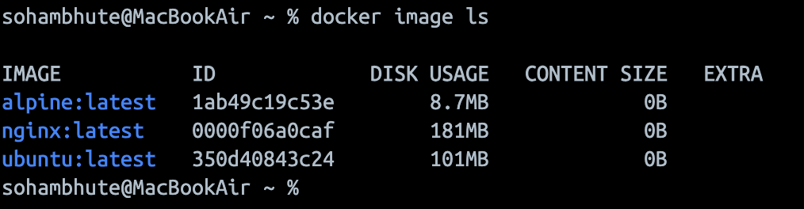
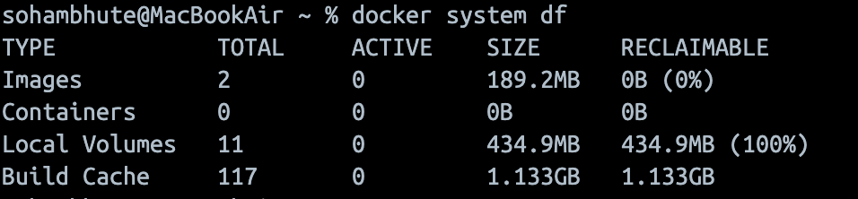

## Challenge Tasks

### Task 1: Docker Images

1. Pull the `nginx`, `ubuntu`, and `alpine` images from Docker Hub `docker image pull`
2. List all images on your machine — note the sizes
   
3. Compare `ubuntu` vs `alpine` — why is one much smaller?
   - Because they are designed specifically for container efficiency. Alpine omits most default packages, keeping only bare essentials
4. Inspect an image — what information can you see?
   - Docker inspect provides detailed information on constructs controlled by Docker.By default, docker inspect will render results in a JSON array.

5. Remove an image you no longer need
   - `docker rmi <image_id> or <image_name>`

---

### Task 2: Image Layers

1. Run `docker image history nginx` — what do you see?

- after running the command it shows the step by step execution log with timestamp. One can observe how the docker file commands are executed sequentially

2. Each line is a **layer**. Note how some layers show sizes and some show 0B

- Yes

3. Write in your notes: What are layers and why does Docker use them?

- A filesystem change created during the image build process.A container is created from the final image and adds one extra writable layer on top.Following are the layers for ex.

```bash
FROM
COPY
RUN
ADD
```

---

### Task 3: Container Lifecycle

Practice the full lifecycle on one container:

1. **Create** a container (without starting it) `docker container create -i -t --name mycontainer alpine`
2. **Start** the container - `docker run -it --name mycontainer alpine` or `docker container start --attach -i mycontainer`
3. **Pause** it and check status `docker container pause <container_id>`
4. **Unpause** it `docker container unpause <container_id>`
5. **Stop** it `docker stop <container_id>`
6. **Restart** it `docker restart <container_id>`
7. **Kill** it `docker kill`
8. **Remove** it `docker rmi <image_id>` or `docker rm <container_id>`

Check `docker ps -a` after each step — observe the state changes.

---

---

### Task 4: Working with Running Containers

1. Run an Nginx container in detached mode
2. View its **logs**
3. View **real-time logs** (follow mode)
4. **Exec** into the container and look around the filesystem
5. Run a single command inside the container without entering it `docker exec <container_name> <command>`
6. **Inspect** the container — find its IP address, port mappings, and mounts `docker inspect <container-id>`

---

### Task 5: Cleanup

1. Stop all running containers in one command `docker stop $(docker ps -a -q)`
2. Remove all stopped containers in one command `docker rm $(docker ps --filter status=exited -q)`
3. Remove unused images `docker image prune`
4. Check how much disk space Docker is using
   

---
