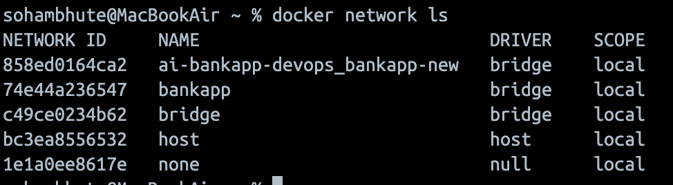
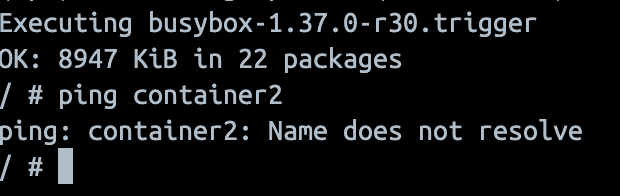

## Challenge Tasks

### Task 1: The Problem

1. Run a Postgres or MySQL container
   `docker run -d -p 3306:3306 -e MYSQL_ROOT_PASSWORD=Test@123 -e MYSQL_DATABASE=bankappdb mysql`
2. Create some data inside it (a table, a few rows — anything)
   `docker exec -it mysql-container mysql -u root -p`
3. Stop and remove the container `docker stop <container_id> && docker rm <container_id>`
4. Run a new one — is your data still there?

- No the data is deleted along with the container. Since the container has ephimeral memory

Write what happened and why.

- When a database container runs without a volume, its data is stored inside the container’s writable layer. If the container is removed, the data is lost because containers are ephemeral by design.

However, when using a Docker volume (via the -v flag), the database files are stored outside the container in a managed volume. Even if the container is stopped or deleted, the data persists and can be reused by a new container mounting the same volume.

---

### Task 2: Named Volumes

1. Create a named volume `-v <volume-name>:<container-path>`
2. Run the same database container, but this time **attach the volume** to it
   `docker run -d -p 3306:3306 -v mysql-data:/var/lib/mysql -e MYSQL_ROOT_PASSWORD=Test@123 -e MYSQL_DATABASE=bankappdb mysql`
3. Add some data, stop and remove the container

4. Run a brand new container with the **same volume**

5. Is the data still there?

- yes, This is because the `-v mysql-data:/var/lib/mysql` option mounts a named Docker volume to the container’s database directory. The volume exists independently of the container lifecycle and is stored on the host system.

---

### Task 3: Bind Mounts

1. Create a folder on your host machine with an `index.html` file
2. Run an Nginx container and **bind mount** your folder to the Nginx web directory `-v <host-path>:<container-path>`
3. Access the page in your browser
4. Edit the `index.html` on your host — refresh the browser

- Yes, changes should reflect instantly after refresh because bind mounts directly map the host directory to the container.
  Write in your notes: What is the difference between a named volume and a bind mount?
  **Verify:** `docker volume ls`, `docker volume inspect`
  | Feature | Named Volume | Bind Mount |
  | ---------------------- | ------------ | ---------- |
  | Stored on host | ✅ Yes | ✅ Yes |
  | Docker manages path | ✅ Yes | ❌ No |
  | You choose host path | ❌ No | ✅ Yes |

---

### Task 4: Docker Networking Basics

1. List all Docker networks on your machine
   

2. Inspect the default `bridge` network
   `docker network inspect bridge`

3. Run two containers on the default bridge — can they ping each other by **name**?
   

- No, they can not access each other by name. Because the `bridge` network does not provide automatic DNS resolution. Only custom bridge network support name-based DNS

4. Run two containers on the default bridge — can they ping each other by **IP**?

- `ping <ip address container 2>` (use docker inspect first)
- Ping with IP address works here.

---

### Task 5: Custom Networks

1. Create a custom bridge network called `my-app-net`

- `docker network `

2. Run two containers on `my-app-net`

- `docker run -dit --name container1 --network my-app-net alpine sh` & `docker run -dit --name container2 --network my-app-net alpine sh`

- `docker exec -it container1 sh` -> `apk add --no-cache iputils` -> `ping container2`

3. Can they ping each other by **name** now?

- Yes, since the custom bridge do provide automatic DNS name resolution.

4. Write in your notes: Why does custom networking allow name-based communication but the default bridge doesn't?

- The default `bridge` network is considered a legacy network mode.

  Docker treats it differently because:
  - It was created for backward compatibility
  - It predates Docker's embedded DNS system
  - It does not isolate DNS namespaces per network

  Custom networks are:
  - User-defined
  - Fully isolated
  - Have their own internal DNS scope

  If default bridge allowed global name resolution:
  - All containers on default bridge would automatically resolve each other
  - That could cause unintended cross-communication
  - Harder to control traffic in multi-project environments

---

### Task 6: Put It Together

1. Create a custom network
2. Run a **database container** (MySQL/Postgres) on that network with a volume for data

```bash
docker run -d \
  --name my-db \
  --network my-network \
  -e MYSQL_ROOT_PASSWORD=Test@123 \
  -e MYSQL_DATABASE=bankappdb \
  mysql:8.0
```

3. Run an **app container** (use any image) on the same network

```bash
docker run -it --rm \
  --network my-network \
  mysql:8.0 \
  mysql -h my-db -u root -pTest@123 bankappdb
```

4. Verify the app container can reach the database by container name
   `SHOW DATABASES;`

---
