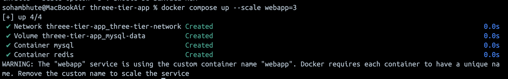

### Task 1: Build Your Own App Stack

Create a `docker-compose.yml` for a 3-service stack:

- A **web app** (use Python Flask, Node.js, or any language you know)
- A **database** (Postgres or MySQL)
- A **cache** (Redis)

Write a simple Dockerfile for the web app. The app doesn't need to be complex — even a "Hello World" that connects to the database is enough.

---

### Task 2: depends_on & Healthchecks

1. Add `depends_on` to your compose file so the app starts **after** the database
2. Add a **healthcheck** on the database service
3. Use `depends_on` with `condition: service_healthy` so the app waits for the database to be truly ready, not just started

**Test:** Bring everything down and up — does the app wait for the DB?

---

### Task 3: Restart Policies

1. Add `restart: always` to your database service
2. Manually kill the database container — does it come back?
3. Try `restart: on-failure` — how is it different?
4. Write in your notes: When would you use each restart policy?

- When the policy `restart: always` is set, docker always restarts the containers upon starting the application. It is very important to take a look at sequence and dependencies in which the services are deployed inside compose.yml

- Using `restart: on-failure` as policy, docker daemon will start the container when internal error appears.

---

### Task 4: Custom Dockerfiles in Compose

1. Instead of using a pre-built image for your app, use `build:` in your compose file to build from a Dockerfile
2. Make a code change in your app
3. Rebuild and restart with one command

- (refer to docker-compose.yml file and `webapp` service)

---

### Task 5: Named Networks & Volumes

1. Define **explicit networks** in your compose file instead of relying on the default
2. Define **named volumes** for database data
3. Add **labels** to your services for better organization
- There are two type of labels 1.service 2. Volume
---

### Task 6: Scaling (Bonus)

1. Try scaling your web app to 3 replicas using `docker compose up --scale`
2. What happens? What breaks?
3. Write in your notes: Why doesn't simple scaling work with port mapping?
- with current syntax `port 3000:3000` only one container can bind to a host at a time.
- if we try to run 3 containers with `3000:3000` , the first container grabs 3000 and others fail
- Port mapping is host specific, internally containers can communicate on inthernal ports without host ports.
- Solution would be use dynamic host porting. `ports: - 3000` (container port remains 3000, host is dynamic)
 - Reverse proxy, load balancer is also imp for cloud 
## 

## Hints

- If something goes wrong with databses use `docker compose down -v` and `perform docker compose up`
- If the source code changes use `docker compose up --build`
