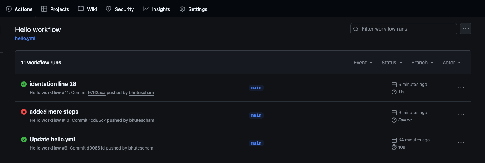
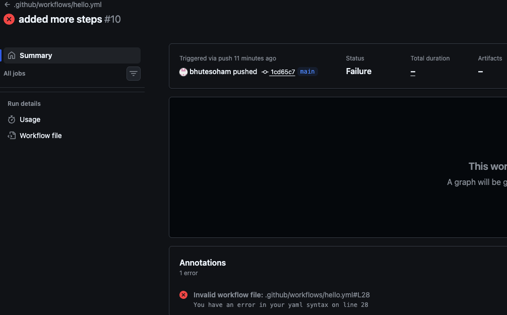

## Challenge Tasks

### Task 1: Set Up

1. Create a new **public** GitHub repository called `github-actions-practice`
2. Clone it locally
3. Create the folder structure: `.github/workflows/`

---

### Task 2: Hello Workflow

Create `.github/workflows/hello.yml` with a workflow that:

1. Triggers on every `push`
2. Has one job called `greet`
3. Runs on `ubuntu-latest`
4. Has two steps:
   - Step 1: Check out the code using `actions/checkout`
   - Step 2: Print `Hello from GitHub Actions!`

Push it. Go to the **Actions** tab on GitHub and watch it run.

**Verify:** Is it green? Click into the job and read every step.

```bash
name: Hello workflow
on:
  push:

jobs:
  greet:
    runs-on: ubuntu-latest

    steps:
      - name: Checkout the code
        uses: actions/checkout@v4 #Action to clone repo

      - name: Print Hello
        run: echo "Hello from GitHub Actions"
```

---

### Task 3: Understand the Anatomy

Look at your workflow file and write in your notes what each key does:

- `on:` -> it deceides whether the action should run every push or the user should run it. defines trigger
- `jobs:` -> it is collection of steps a workflow can have multiple jobs . each job has a runner and they run parallel by default
- `runs-on:` -> it runs the action on a standard runner or a custom runner (a VM)
- `steps:` -> within a job you have multiple steps which pulls the repo, prints the message
- `uses:` -> It calls reusable actions (from GitHub Marketplace or your own repo), not just GitHub Pages.
- `run:` -> it runs the commands on runner like echo,grep etc.
- `name:` (on a step) An optional label that makes the logs easier to read

---

### Task 4: Add More Steps

Update `hello.yml` to also:

1. Print the current date and time
2. Print the name of the branch that triggered the run (hint: GitHub provides this as a variable)
3. List the files in the repo
4. Print the runner's operating system

Push again — watch the new run.

---

### Task 5: Break It On Purpose

1. Add a step that runs a command that will **fail** (e.g., `exit 1` or a misspelled command)

2. Push and observe what happens in the Actions tab

- It fails and shows a red cross mark as indication

3. Fix it and push again

Write in your notes: What does a failed pipeline look like? How do you read the error?

- Under Github GUI -> Actions the pipeline shows red cross if the yml file fails to deploy. In other case it shows green tick when it is successful. To read the error you can click on the workflow runs -> job (greet) -> navigate to the failed step
  
  

---
