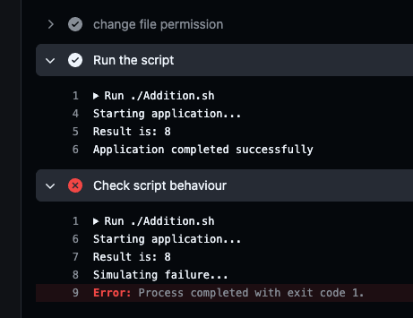

## Challenge Tasks

### Task 1: GitHub Secrets

1. Go to your repo → Settings → Secrets and Variables → Actions
2. Create a secret called `MY_SECRET_MESSAGE`
3. Create a workflow that reads it and prints: `The secret is set: true` (never print the actual value)
4. Try to print `${{ secrets.MY_SECRET_MESSAGE }}` directly — what does GitHub show?

- the github logs shows `***` instead of the actual value for secret it prints the placeholder for it.

Write in your notes: Why should you never print secrets in CI logs?

- printing secrets can make the pipeline vulnerable for attacks. Hence from security point of view it is not recommended.

---

### Task 2: Use Secrets as Environment Variables

1. Pass a secret to a step as an environment variable
2. Use it in a shell command without ever hardcoding it
3. Add `DOCKER_USERNAME` and `DOCKER_TOKEN` as secrets (you'll need these on Day 45)

- `use-secrets-var.yml`

---

### Task 3: Upload Artifacts

1. Create a step that generates a file — e.g., a test report or a log file
2. Use `actions/upload-artifact` to save it
3. After the workflow runs, download the artifact from the Actions tab

**Verify:** Can you see and download it from GitHub

- Yes we can see and download it under artifacts section inside the actions -> latest run -> Artifacts -> my-report (`upload-artifacts.yml`)

---

### Task 4: Download Artifacts Between Jobs

1. Job 1: generate a file and upload it as an artifact (partially upload artifacts from above)
2. Job 2: download the artifact from Job 1 and use it (print its contents)

Write in your notes: When would you use artifacts in a real pipeline?

- Artifacts are used to store and share files generated during a workflow, such as build outputs, test reports, logs, or analysis results. They allow these files to be downloaded later or passed between jobs in the pipeline for further processing or deployment.
- refer to `upload-artifacts.yml`

---

### Task 5: Run Real Tests in CI

Take any script from your earlier days (Python or Shell) and run it in CI:

1. Add your script to the `github-actions-practice` repo
2. Write a workflow that:
   - Checks out the code
   - Installs any dependencies needed
   - Runs the script
   - Fails the pipeline if the script exits with a non-zero code
3. Intentionally break the script — verify the pipeline goes red
4. Fix it — verify it goes green again
   `ci-testing.yml`

## 

---

### Task 6: Caching

1. Add `actions/cache` to a workflow that installs dependencies
2. Run it twice — observe the time difference
3. Write in your notes: What is being cached and where is it stored?

- It caches the directory `~/.cache/pip` which includes downloaded package archives, wheel files, dependency packages
- The cache is stored at location `Linux-pip-3.11-94e69db670a7aaa67050858651b85015bc060b293dca52795367b8ce6fe23d1b`
- `use-cache.yml`

---
