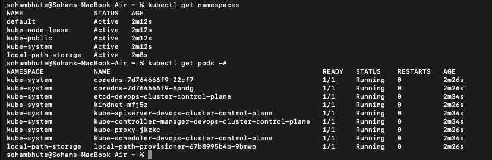

### Task 1: Recall the Kubernetes Story

Before touching a terminal, write down from memory:

1. Why was Kubernetes created? What problem does it solve that Docker alone cannot?

- Docker does not have auto scaling and auto healing property which is solved by kubernetes.Docker also has no built-in service discovery, load balancing, rolling updates, or cross-machine orchestration. Running containers at scale across many machines requires something above Docker — that's Kubernetes.

2. Who created Kubernetes and what was it inspired by?

- it is created by google.It was inspired by Google's internal cluster management system called Borg (and later Omega), which Google had been running for over a decade to manage billions of containers in production.

3. What does the name "Kubernetes" mean?

- The name "Kubernetes" comes from the Greek word κυβερνήτης meaning helmsman or pilot — the person who steers a ship. That's the origin of the wheel icon in the Kubernetes logo.

- Do not look anything up yet. Write what you remember from the session, then verify against the official docs.

---

### Task 2: Draw the Kubernetes Architecture

From memory, draw or describe the Kubernetes architecture. Your diagram should include:

**Control Plane (Master Node):**

- API Server — the front door to the cluster, every command goes through it
- etcd — the database that stores all cluster state
- Scheduler — decides which node a new pod should run on
- Controller Manager — watches the cluster and makes sure the desired state matches reality

**Worker Node:**

- kubelet — the agent on each node that talks to the API server and manages pods
- kube-proxy — handles networking rules so pods can communicate
- Container Runtime — the engine that actually runs containers (containerd, CRI-O)

After drawing, verify your understanding:

- What happens when you run `kubectl apply -f pod.yaml`? Trace the request through each component.
- User -> API Server(the gatekeeper) -> etcd (the database) -> Scheduler (the matchmaker) -> Kubelet (on assigned node) -> Container runtime (containerd) -> kubelet (reports back)
- What happens if the API server goes down?

- The cluster keeps running. Nothing new can happen.
  Here's why:

- The kubelet on each node already has its instructions. Containers keep running.
- etcd still has all the state — nothing is lost.
- The Scheduler and Controller Manager can't do anything — they talk exclusively through the API Server, so they go idle.

- What breaks:

- kubectl commands fail — you can't see, create, or delete anything
- No new pods can be scheduled
- No auto-healing — if a pod crashes during this window, the Controller Manager can't create a replacement (it can't reach the API Server to write the new pod)
- No rolling updates, no scaling

- The analogy: HQ phones go down. The factory floor keeps running the last set of instructions. But nobody can give new orders or fix problems until HQ comes back.

- What happens if a worker node goes down?
  The control plane notices and reschedules the pods elsewhere.
  Here's the exact sequence:
  ① Node stops sending heartbeats
  Every kubelet sends a heartbeat to the API Server every few seconds. If the API Server stops receiving them, it marks the node as NotReady after about 40 seconds.
  ② Controller Manager acts
  After roughly 5 minutes (configurable), the Controller Manager declares the node Unknown and evicts its pods — meaning it marks those pods for deletion.
  ③ Scheduler reschedules
  The evicted pods are now unscheduled (nodeName is empty again). The Scheduler picks healthy nodes and places them there. Kubernetes recreates the pods from scratch on surviving nodes.
- What is lost:

Anything stored inside the container (local disk) — gone permanently
The gap between node failure and pod recovery (~5 min default) — your app was partially down

- What is NOT lost:

Data in external storage (Persistent Volumes, databases)
The pod spec — etcd still has it, so Kubernetes knows exactly what to recreate

---

Task 4 - Setup local cluster

- I choose kind for this becuase it is light weight and significantly faster . It is tailored for rapid, multi-node testing and CI/CD pipelines

```bash
 brew install kind
```

**Option A: kind (Kubernetes in Docker)**

```bash
# Install kind
# macOS
brew install kind

# Linux
curl -Lo ./kind https://kind.sigs.k8s.io/dl/latest/kind-linux-amd64
chmod +x ./kind
sudo mv ./kind /usr/local/bin/kind

# Create a cluster
kind create cluster --name devops-cluster

# Verify
kubectl cluster-info
kubectl get nodes
```

---

### Task 5: Explore Your Cluster

Now that your cluster is running, explore it:

```bash
# See cluster info
kubectl cluster-info

# List all nodes
kubectl get nodes

# Get detailed info about your node
kubectl describe node <node-name>

# List all namespaces
kubectl get namespaces

# See ALL pods running in the cluster (across all namespaces)
kubectl get pods -A
```

Look at the pods running in the `kube-system` namespace:

```bash
kubectl get pods -n kube-system
```

You should see pods like `etcd`, `kube-apiserver`, `kube-scheduler`, `kube-controller-manager`, `coredns`, and `kube-proxy`. These are the architecture components you drew in Task 2 — running as pods inside the cluster.



**Verify:** Can you match each running pod in `kube-system` to a component in your architecture diagram?

Write down: What is a kubeconfig? Where is it stored on your machine?

- A kubeconfig file is a configuration file that kubectl command-line tool uses to find authenticate and communicate with Kubernetes clusters. It acts as a passport and itinerary , telling your terminal where your cluster lives and who you are
- Core components -> Clusters, Users, Contexts
- The default location for kubeconfig is under ~/.kube/config directory
