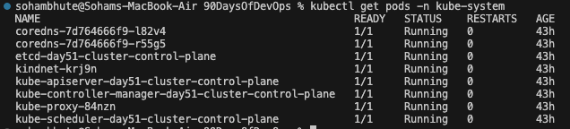
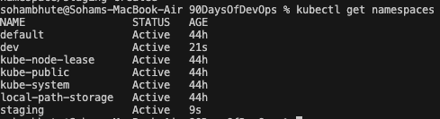
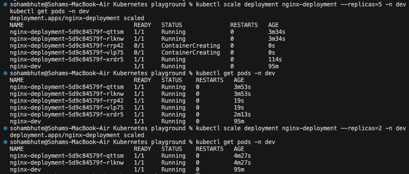

- What namespaces are and why you would use them
  - In k8s namespaces provide a mechanism for isolating groups of resources within a single cluster. Names of resources need ot be unique within a namespace, bit not across namespaces. For clusters with a few to then of users , you should not need to create or think about namespaces at all

- Your Deployment manifest and an explanation of each section
  - A Deployment named nginx-deployment is created, indicated by the .metadata.name field. This name will become the basis for the ReplicaSets and Pods which are created later.

```
apiVersion: apps/v1
kind: Deployment
metadata:
  name: nginx-deployment
  labels:
    app: nginx
spec:
  replicas: 3
  selector:
    matchLabels:
      app: nginx
  template:
    metadata:
      labels:
        app: nginx
    spec:
      containers:
      - name: nginx
        image: nginx:1.14.2
        ports:
        - containerPort: 80

```

    - The Deployment creates a ReplicaSet that creates three replicated Pods, indicated by the .spec.replicas field.

    - The .spec.selector field defines how the created ReplicaSet finds which Pods to manage. In this case, you select a label that is defined in the Pod template (app: nginx). However, more sophisticated selection rules are possible, as long as the Pod template itself satisfies the rule.

    - The .spec.template field contains the following sub-fields:

      - The Pods are labeled app: nginx using the .metadata.labels field.
      - The Pod template's specification, or .spec field, indicates that the Pods run one container, nginx, which runs the nginx Docker Hub image at version 1.14.2.
      - Create one container and name it nginx using the .spec.containers[0].name field.

- What happens when you delete a Pod managed by a Deployment vs a standalone Pod
  - when we delete a standalone pod it is permanently deleted. And when we delete the pod managed by Deployment the deployment makes sure that there are exactly equal number of pods as defined in the replica

- How scaling works (both imperative and declarative)
  - `kubectl scale deployment <name> --replicas` scales the pod imperatively(how) while defining it .yaml manifest and a controller automatically manipulates the resources to match that the scaling can be done declarative (what)

- How rolling updates and rollbacks work
  - A rolling update is a deployment strategy that updates an application incrementally, replacing old instances with new ones without causing downtime. A rollback is the safety mechanism that reverts the system to the last stable version if the new update fails or introduces bugs

- Screenshot of your Deployment and Pods running

---

### Task 1: Explore Default Namespaces

Kubernetes comes with built-in namespaces. List them:

```bash
kubectl get namespaces
```

You should see at least:

- `default` — where your resources go if you do not specify a namespace
- `kube-system` — Kubernetes internal components (API server, scheduler, etc.)
- `kube-public` — publicly readable resources
- `kube-node-lease` — node heartbeat tracking

Check what is running inside `kube-system`:

```bash
kubectl get pods -n kube-system
```



How many pods are running in kube-system ?

- Total 8 pods

---

### Task 2: Create and Use Custom Namespaces

Create two namespaces — one for a development environment and one for staging:

```bash
kubectl create namespace dev
kubectl create namespace staging
```

Verify they exist:

```bash
kubectl get namespaces
```



You can also create a namespace from a manifest:

```yaml
# namespace.yaml
apiVersion: v1
kind: Namespace
metadata:
  name: production
```

```bash
kubectl apply -f namespace.yaml
```

List pods across all namespaces:

```bash
kubectl get pods -A
```

Notice that `kubectl get pods` without `-n` only shows the `default` namespace. You must specify `-n <namespace>` or use `-A` to see everything.

**Verify:** Does `kubectl get pods` show these pods? What about `kubectl get pods -A`?

- No, because the pods are either running in kube-system , dev or staging namespace , none of them is in default namespace

---

### Task 3: Create Your First Deployment

A Deployment tells Kubernetes: "I want X replicas of this Pod running at all times." If a Pod crashes, the Deployment controller recreates it automatically.

Create a file `nginx-deployment.yaml`:

```yaml
apiVersion: apps/v1
kind: Deployment
metadata:
  name: nginx-deployment
  namespace: dev
  labels:
    app: nginx
spec:
  replicas: 3
  selector:
    matchLabels:
      app: nginx
  template:
    metadata:
      labels:
        app: nginx
    spec:
      containers:
        - name: nginx
          image: nginx:1.24
          ports:
            - containerPort: 80
```

Key differences from a standalone Pod:

- `kind: Deployment` instead of `kind: Pod`
- `apiVersion: apps/v1` instead of `v1`
- `replicas: 3` tells Kubernetes to maintain 3 identical pods
- `selector.matchLabels` connects the Deployment to its Pods
- `template` is the Pod template — the Deployment creates Pods using this blueprint

Apply it:

```bash
kubectl apply -f nginx-deployment.yaml
```

Check the result:

```bash
kubectl get deployments -n dev
kubectl get pods -n dev
```

You should see 3 pods with names like `nginx-deployment-xxxxx-yyyyy`.

**Verify:** What do the READY, UP-TO-DATE, and AVAILABLE columns mean in the deployment output?

---

### Task 4: Self-Healing — Delete a Pod and Watch It Come Back

This is the key difference between a Deployment and a standalone Pod.

```bash
# List pods
kubectl get pods -n dev

# Delete one of the deployment's pods (use an actual pod name from your output)
kubectl delete pod <pod-name> -n dev

# Immediately check again
kubectl get pods -n dev
```

The Deployment controller detects that only 2 of 3 desired replicas exist and immediately creates a new one. The deleted pod is replaced within seconds.

**Verify:** Is the replacement pod's name the same as the one you deleted, or different?



---

### Task 4: Self-Healing — Delete a Pod and Watch It Come Back

This is the key difference between a Deployment and a standalone Pod.

```bash
# List pods
kubectl get pods -n dev

# Delete one of the deployment's pods (use an actual pod name from your output)
kubectl delete pod <pod-name> -n dev

# Immediately check again
kubectl get pods -n dev
```

The Deployment controller detects that only 2 of 3 desired replicas exist and immediately creates a new one. The deleted pod is replaced within seconds.

**Verify:** Is the replacement pod's name the same as the one you deleted, or different?

- It runs the older image 1.24 version.

---

### Task 7: Clean Up

```bash
kubectl delete deployment nginx-deployment -n dev
kubectl delete pod nginx-dev -n dev
kubectl delete pod nginx-staging -n staging
kubectl delete namespace dev staging production
```

Deleting a namespace removes everything inside it. Be very careful with this in production.

```bash
kubectl get namespaces
kubectl get pods -A
```

**Verify:** Are all your resources gone?

- No becuase my old pods were running in kube system . So to delete them, I need to delete the complete cluster

---
