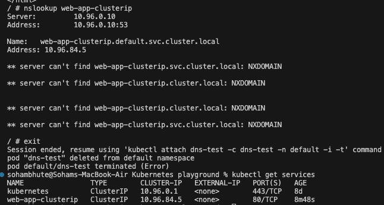
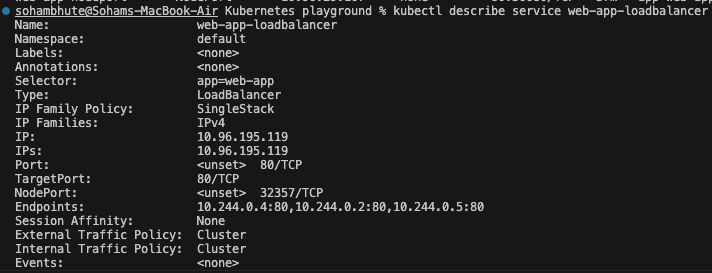

## Why Services?

Every Pod gets its own IP address. But there are two problems:

1. Pod IPs are **not stable** — when a Pod restarts or gets replaced, it gets a new IP
2. A Deployment runs **multiple Pods** — which IP do you connect to?

A Service solves both problems. It provides:

- A **stable IP and DNS name** that never changes
- **Load balancing** across all Pods that match its selector

```
[Client] --> [Service (stable IP)] --> [Pod 1]
                                   --> [Pod 2]
                                   --> [Pod 3]


```

---

## Questions

- What problem Services solve and how they relate to Pods and Deployments
  - pods do not have long lived IP address , it keeps on changing or replaced ,so services give stable IP address as well as does the task of load balancing

- Your three Service manifests with an explanation of each type
  - ClusterIP Service - it gives pod a stable internal IP reachable from within the cluster
  - Nodeport service - exposes the application on a port on every node in the cluster, lets you access the service from outside the cluster
  - LoadBalancer Service - It provides real external load balancer that routes traffic to your nodes
- The difference between ClusterIP, NodePort, and LoadBalancer
  | Type | Accessible From | Use Case |
  |------|----------------|----------|
  | ClusterIP | Inside the cluster only | Internal communication between services |
  | NodePort | Outside via `<NodeIP>:<NodePort>` | Development, testing, direct node access |
  | LoadBalancer | Outside via cloud load balancer | Production traffic in cloud environments |

- How Kubernetes DNS works for service discovery

- What Endpoints are and how to inspect them
  - endpoints are the IP addresses of the running pods, to inspect them one can use `kubectl describe service web-app-loadbalancer`
- Screenshot of your services and the test output

---

### Task 1: Deploy the Application

First, create a Deployment that you will expose with Services. Create `app-deployment.yaml`:

---

### Task 2: ClusterIP Service (Internal Access)

ClusterIP is the default Service type. It gives your Pods a stable internal IP that is only reachable from within the cluster.

Create `clusterip-service.yaml`:

```yaml
apiVersion: v1
kind: Service
metadata:
  name: web-app-clusterip
spec:
  type: ClusterIP
  selector:
    app: web-app
  ports:
    - port: 80
      targetPort: 80
```

Key fields:

- `selector.app: web-app` — this Service routes traffic to all Pods with the label `app: web-app`
- `port: 80` — the port the Service listens on
- `targetPort: 80` — the port on the Pod to forward traffic to

```bash
kubectl apply -f clusterip-service.yaml
kubectl get services
```

You should see `web-app-clusterip` with a CLUSTER-IP address. This IP is stable — it will not change even if Pods restart.

Now test it from inside the cluster:

```bash
# Run a temporary pod to test connectivity
kubectl run test-client --image=busybox:latest --rm -it --restart=Never -- sh

# Inside the test pod, run:
wget -qO- http://web-app-clusterip
exit
```

You should see the Nginx welcome page. The Service load-balanced your request to one of the 3 Pods.

**Verify:** Does the Service respond? Try running the wget command multiple times — the Service distributes traffic across all healthy Pods.

- Yes the service responds, but how to see which pod is serving the nginx page?

---

### Task 3: Discover Services with DNS

Kubernetes has a built-in DNS server. Every Service gets a DNS entry automatically:

```
<service-name>.<namespace>.svc.cluster.local
```

Test this:

```bash
kubectl run dns-test --image=busybox:latest --rm -it --restart=Never -- sh

# Inside the pod:
# Short name (works within the same namespace)
wget -qO- http://web-app-clusterip

# Full DNS name
wget -qO- http://web-app-clusterip.default.svc.cluster.local

# Look up the DNS entry
nslookup web-app-clusterip
exit
```

Both the short name and the full DNS name resolve to the same ClusterIP. In practice, you use the short name when communicating within the same namespace and the full name when reaching across namespaces.

**Verify:** What IP does `nslookup` return? Does it match the CLUSTER-IP from `kubectl get services`?

- No they are not the same



---

### Task 4: NodePort Service (External Access via Node)

A NodePort Service exposes your application on a port on every node in the cluster. This lets you access the Service from outside the cluster.

Create `nodeport-service.yaml`:

```yaml
apiVersion: v1
kind: Service
metadata:
  name: web-app-nodeport
spec:
  type: NodePort
  selector:
    app: web-app
  ports:
    - port: 80
      targetPort: 80
      nodePort: 30080
```

- `nodePort: 30080` — the port opened on every node (must be in range 30000-32767)
- Traffic flow: `<NodeIP>:30080` -> Service -> Pod:80

```bash
kubectl apply -f nodeport-service.yaml
kubectl get services
```

Access the service:

```bash
# If using Minikube
minikube service web-app-nodeport --url

# If using Kind, get the node IP first
kubectl get nodes -o wide
# Then curl <node-internal-ip>:30080

# If using Docker Desktop
curl http://localhost:30080
```

**Verify:** Can you see the Nginx welcome page from your browser or terminal using the NodePort?

- LoadBalancer services depend on a cloud provider (AWS, GCP, Azure) to:
  - Provision an actual external load balancer (like AWS ELB)
  - Assign it a public IP
  - Report that IP back to Kubernetes as EXTERNAL-IP

- On a local kind cluster, there is no cloud provider, so Kubernetes waits forever for an IP that never comes → `<pending>`.

---

### Task 6: Understand the Service Types Side by Side

Check all three services:

```bash
kubectl get services -o wide
```

Compare them:

| Type         | Accessible From                   | Use Case                                 |
| ------------ | --------------------------------- | ---------------------------------------- |
| ClusterIP    | Inside the cluster only           | Internal communication between services  |
| NodePort     | Outside via `<NodeIP>:<NodePort>` | Development, testing, direct node access |
| LoadBalancer | Outside via cloud load balancer   | Production traffic in cloud environments |

Each type builds on the previous one:

- LoadBalancer creates a NodePort, which creates a ClusterIP
- So a LoadBalancer service also has a ClusterIP and a NodePort

Verify this:

```bash
kubectl describe service web-app-loadbalancer
```

You should see all three: a ClusterIP, a NodePort, and the LoadBalancer configuration.

**Verify:** Does the LoadBalancer service also have a ClusterIP and NodePort assigned?


---

### Task 7: Clean Up

```bash
kubectl delete -f app-deployment.yaml
kubectl delete -f clusterip-service.yaml
kubectl delete -f nodeport-service.yaml
kubectl delete -f loadbalancer-service.yaml

kubectl get pods
kubectl get services
```

Only the built-in `kubernetes` service in the default namespace should remain.

**Verify:** Is everything cleaned up?

- yes

---
